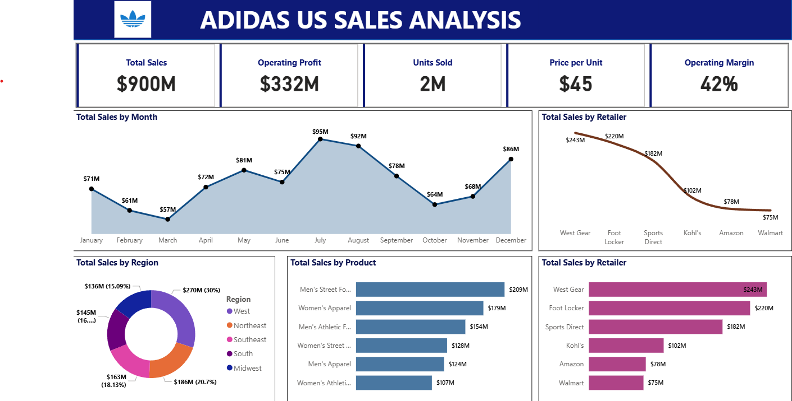

# 📈 Adidas US Sales Performance Analysis

This project presents a comprehensive analysis of Adidas US sales data, offering a visual overview of key business metrics, including total sales, revenue, and profit. The analysis delves into sales trends across regions, product categories, and sales channels to identify performance drivers and growth opportunities.

---

## 🔍 Analysis Highlights  

The analysis focuses on the following key insights:  

- **Sales Performance by Region:** Breakdown of sales, revenue, and profit by region, state, and city.  
- **Revenue and Profit Trends:** Month-wise analysis to identify peak and low-performing periods.  
- **Product Category Analysis:** Sales and profitability insights across Men's and Women's Footwear, Apparel, and Accessories.  
- **Sales Channel Effectiveness:** Comparison of In-store and Online sales performance.  
- **KPIs Overview:** Key performance indicators such as Total Sales, Operating Profit, Units Sold, Price per Unit, and Operating Margin.  

---

## 📂 Dataset Overview  

The dataset used for this analysis can be accessed [here](Adidas-US-Sales.xlsx).  

The dataset comprises detailed sales records from Adidas US, including the following attributes:  

- **Retailer and Retailer ID:** Identifies the selling entity and its unique identifier.  
- **Invoice Date:** Transaction date for each sale.  
- **Region, State, City:** Geographical information for sales distribution.  
- **Product Category:** Specific product categories, e.g., Men's Street Footwear, Women's Apparel.  
- **Price per Unit:** Unit price for each product sold.  
- **Units Sold:** Number of units sold per transaction.  
- **Total Sales:** Revenue generated from each transaction.  
- **Operating Profit & Margin:** Profit and profit margin percentage for each sale.  
- **Sales Method:** Sales channels such as In-store or Online.  

---

## 🛠️ Tools and Technologies  

- **Power BI:** For interactive dashboards and visualizations.  
- **Python (Pandas, Matplotlib, Seaborn):** Data preprocessing and initial analysis.  
- **Excel:** Data cleaning and basic analysis.  

---

## 🖼️ Analysis Dashboard  

Below is a visual summary of the analysis, showcasing key metrics and insights.  

  

---

## 🚀 Key Findings and Insights  

- **Top Retailer:** West Gear generated the highest revenue with $243M in sales.  
- **Leading Product Category:** Men's Street Footwear led in sales with $209M, followed by Women's Apparel at $179M.  
- **Peak Sales Period:** July recorded the highest sales with $95M, driven by strong footwear sales.  
- **Regional Sales Analysis:** The West region dominated with $270M in total sales, representing 30% of overall sales.  
- **Channel Performance:** In-store sales accounted for the majority of revenue, indicating potential for online expansion.  

---

## 📈 Further Analysis Recommendations  

- Conduct customer segmentation to identify key demographics and target markets.  
- Develop predictive models to forecast future sales based on historical data.  
- Explore product-specific profitability to identify high-margin products.  
- Analyze seasonal trends to optimize inventory and marketing strategies.  

---
